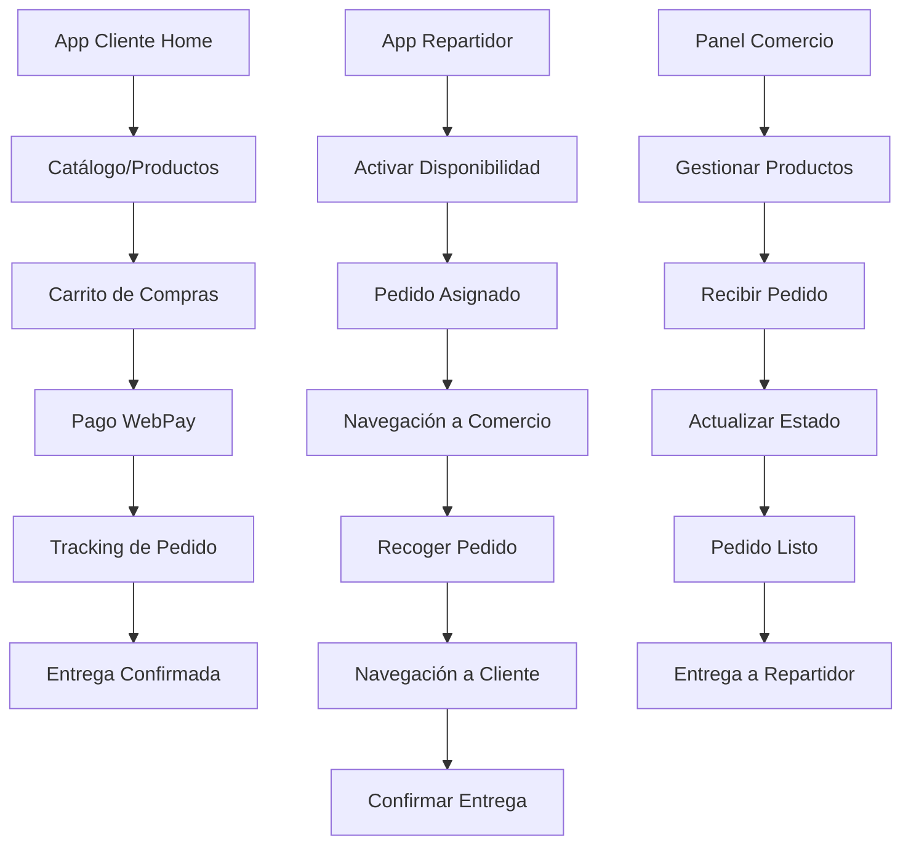

## 1. Product Overview
Flash Drop es una plataforma de delivery chilena que conecta clientes, comercios y repartidores en un ecosistema unificado. Resuelve la necesidad de entregas rápidas y confiables, permitiendo a los usuarios pedir productos locales con seguimiento en tiempo real y pagos seguros vía WebPay.

El producto está diseñado para el mercado chileno, cumpliendo con regulaciones locales y ofreciendo una experiencia móvil optimizada tanto para Android como iOS.

## 2. Core Features

### 2.1 User Roles
| Role | Registration Method | Core Permissions |
|------|---------------------|------------------|
| Cliente | Registro con email/telefono | Buscar productos, realizar pedidos, tracking en vivo |
| Repartidor | Registro con validación de documentos | Aceptar entregas, navegación GPS, confirmar entregas |
| Comercio | Registro con validación de empresa | Gestionar catálogo, recibir pedidos, configurar tarifas |
| Administrador | Asignación manual | Control total de plataforma, moderación, configuración |

### 2.2 Feature Module
Nuestra aplicación de delivery consta de las siguientes interfaces principales:

1. **App Cliente**: Catálogo de productos, carrito de compras, seguimiento de pedidos, historial de ordenes.
2. **App Repartidor**: Gestión de disponibilidad, pedidos asignados, navegación GPS, confirmación de entrega.
3. **Panel Comercio**: Dashboard de ventas, gestión de productos, control de pedidos, reportes estadísticos.
4. **Panel Administrador**: Métricas globales, moderación de usuarios, configuración de tarifas, gestión de reclamos.

### 2.3 Page Details
| Page Name | Module Name | Feature description |
|-----------|-------------|---------------------|
| App Cliente - Home | Búsqueda y Catálogo | Explorar productos por categorías, filtros avanzados, motor de búsqueda por palabras clave |
| App Cliente - Home | Carrito de Compras | Agregar/eliminar ítems, aplicar cupones de descuento, ver total con envío |
| App Cliente - Pago | Checkout WebPay | Procesar pagos seguros mediante WebPay, confirmación de orden |
| App Cliente - Tracking | Seguimiento en Vivo | Visualizar ubicación del repartidor en mapa, línea de tiempo de progreso del pedido |
| App Cliente - Soporte | Reclamos y Ayuda | Crear tickets de soporte, adjuntar fotos de problemas, historial de reclamos |
| App Repartidor - Dashboard | Disponibilidad | Activar/desactivar estado de disponibilidad con un botón toggle |
| App Repartidor - Pedidos | Lista de Entregas | Ver pedidos asignados con detalles de productos y dirección de entrega |
| App Repartidor - Navegación | GPS Integrado | Iniciar navegación con Google Maps hacia cliente y comercio |
| App Repartidor - Entrega | Confirmación | Tomar foto o firma digital como evidencia de entrega exitosa |
| App Repartidor - Finanzas | Historial y Ganancias | Ver entregas completadas, calcular ganancias por período seleccionado |
| Panel Comercio - Productos | CRUD Catálogo | Crear, editar, eliminar productos con imágenes, precios y stock |
| Panel Comercio - Pedidos | Gestión de Órdenes | Recibir notificaciones de nuevos pedidos, actualizar estados (preparando, listo) |
| Panel Comercio - Configuración | Tarifas de Envío | Establecer tarifas de envío propias por zona o distancia |
| Panel Comercio - Reportes | Estadísticas | Visualizar ventas por período, productos más vendidos, errores de pedido |
| Panel Admin - Dashboard | Métricas Globales | Ver total de pedidos, usuarios activos, ingresos de la plataforma |
| Panel Admin - Moderación | Aprobación de Cuentas | Validar y aprobar registros de nuevos comercios y repartidores |
| Panel Admin - Control | Gestión de Usuarios | Bloquear/desbloquear cuentas por mal uso o violaciones |
| Panel Admin - Configuración | Tarifas y Comisiones | Definir tarifas de envío base y porcentaje de comisión por transacción |

## 3. Core Process

### Flujo Cliente
1. Usuario se registra/loguea en la app móvil
2. Explora productos y agrega al carrito
3. Procede al pago mediante WebPay
4. Recibe confirmación y tracking en tiempo real
5. Puede crear reclamos dentro de 24 horas si hay problemas

### Flujo Repartidor
1. Repartidor activa su disponibilidad
2. Sistema asigna pedidos automáticamente
3. Repartidor navega hacia el comercio
4. Recoge el pedido y navega hacia el cliente
5. Confirma entrega con evidencia (foto/firma)

### Flujo Comercio
1. Comercio registra y valida su cuenta
2. Carga productos al catálogo
3. Recibe pedidos y actualiza estados
4. Gestiona tarifas de envío propias
5. Monitorea reportes de ventas y errores

## 4. User Interface Design

### 4.1 Design Style
- **Colores Primarios**: Amarillo FlashDrop (#FFC107), Negro Profundo (#121212), Blanco Puro (#FFFFFF)
- **Colores Secundarios**: Gris Medio (#757575) para textos secundarios, Verde Éxito (#4CAF50), Rojo Error (#D32F2F)
- **Tema Visual**:
  - **Modo Claro**: Fondos blancos (#FFFFFF) con acentos en Amarillo FlashDrop y texto negro (#000000).
  - **Modo Oscuro**: Fondos oscuros (#121212) con acentos en Amarillo FlashDrop y texto blanco (#FFFFFF).
- **Estilo de Botones**: Pill-shaped (redondeados completos) para acciones principales (Negro sobre Amarillo), Icon Buttons circulares.
- **Tipografía**: Roboto para Android, SF Pro Display para iOS, jerarquía clara con negritas para encabezados.
- **Layout**: Interfaces limpias con Headers sólidos en Amarillo (Modo Claro) o Translucidos (Modo Mapa), Cards con sombras suaves.
- **Iconos**: Iconos minimalistas (Lucide-react o Material Icons), rellenos o contorneados según estado activo/inactivo.

### 4.2 Page Design Overview
| Page Name | Module Name | UI Elements |
|-----------|-------------|-------------|
| App Cliente - Home | Header de Búsqueda | Barra superior con campo de búsqueda, icono de perfil y notificaciones |
| App Cliente - Home | Grid de Categorías | Cards horizontales deslizables con iconos de categorías y colores distintivos |
| App Cliente - Home | Lista de Productos | Cards verticales con imagen, nombre, precio y botón "Agregar" prominente |
| App Cliente - Carrito | Resumen de Orden | Lista desplegable de ítems con cantidad editable, total dinámico en footer sticky |
| App Cliente - Tracking | Mapa Principal | Mapa fullscreen con pin del repartidor en tiempo real y ruta trazada |
| App Cliente - Tracking | Timeline de Progreso | Barra horizontal en parte inferior mostrando estados: Confirmado → Preparando → En Camino → Entregado |
| App Repartidor - Dashboard | Toggle Disponibilidad | Switch grande y central con indicador visual de estado (verde/rojo) |
| App Repartidor - Pedidos | Lista de Entregas | Cards con dirección, monto y tiempo estimado, swipe para aceptar/rechazar |
| Panel Comercio - Productos | Tabla de Gestión | DataTable con búsqueda, filtros y acciones de editar/eliminar con iconos |
| Panel Admin - Dashboard | Widgets de Métricas | Cards con KPIs destacados: total pedidos hoy, usuarios activos, ingresos del mes |

### 4.3 Responsiveness
- **Mobile-First**: Diseñado principalmente para apps móviles (Android/iOS)
- **Panel Web**: Responsive design que se adapta a tablets y desktops
- **Touch Optimization**: Botones mínimo 48px, espaciado generoso para interacción táctil
- **Performance**: Lazy loading de imágenes, paginación de listas largas

### 4.4 3D Scene Guidance
No aplica para este proyecto - la interfaz es completamente 2D con mapas integrados.