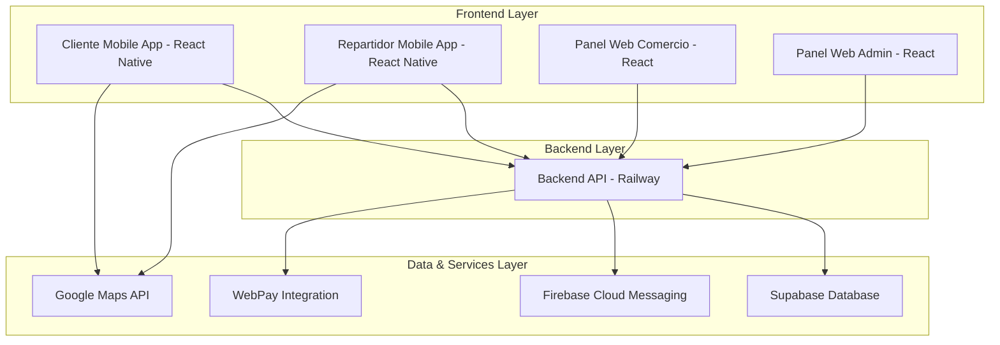
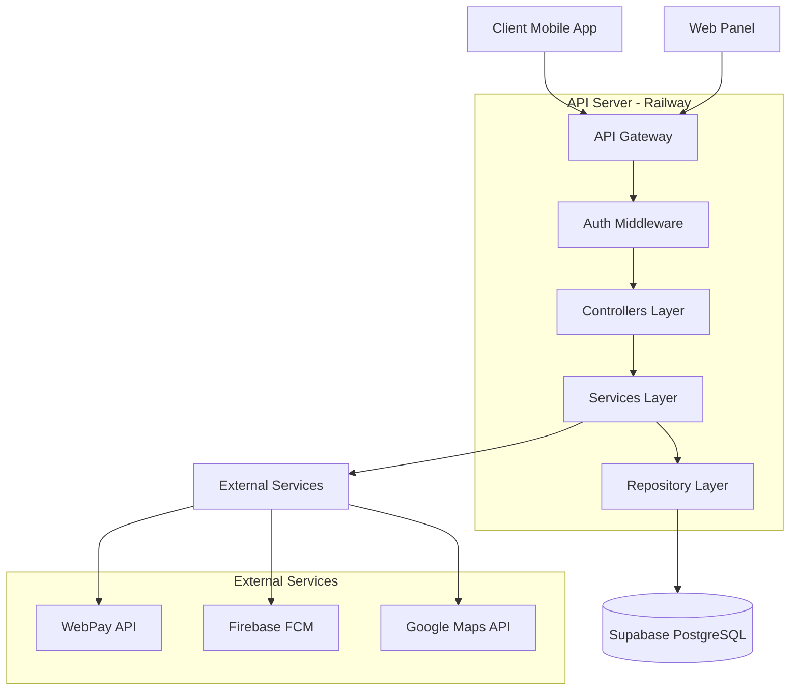
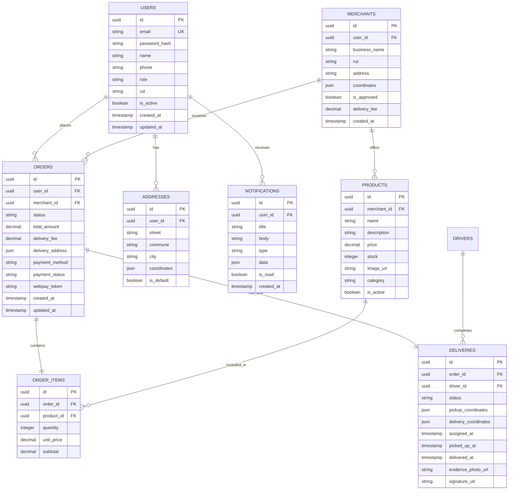

## 1. Architecture design



## 2. Technology Description

- **Frontend Mobile**: React Native@0.72 + React Navigation@6 + React Native Paper
- **Frontend Web**: React@18 + Vite + TailwindCSS@3 + Material-UI@5
- **Initialization Tool**: create-react-native-app (mobile), vite-init (web)
- **Backend**: Node.js@18 + Express@4 + TypeScript
- **Database**: Supabase (PostgreSQL) + Redis para caché
- **Authentication**: Supabase Auth con JWT tokens
- **Real-time**: Supabase Realtime para actualizaciones en vivo
- **Push Notifications**: Firebase Cloud Messaging (FCM)
- **Maps**: Google Maps API + React Native Maps
- **Payments**: WebPay Plus API
- **File Storage**: Supabase Storage para imágenes de productos

## 3. Route definitions

### Mobile App Routes (React Native Navigation)
| Route | Purpose |
|-------|---------|
| / | Splash screen inicial |
| /auth/login | Login de usuarios |
| /auth/register | Registro de nuevos usuarios |
| /cliente/home | Home del cliente con catálogo |
| /cliente/search | Búsqueda de productos |
| /cliente/cart | Carrito de compras |
| /cliente/checkout | Proceso de pago |
| /cliente/tracking/:orderId | Seguimiento de pedido |
| /cliente/profile | Perfil del usuario |
| /repartidor/dashboard | Dashboard del repartidor |
| /repartidor/orders | Lista de pedidos asignados |
| /repartidor/navigation | Navegación GPS |
| /repartidor/delivery/:orderId | Confirmación de entrega |
| /repartidor/earnings | Historial de ganancias |

### Web Panel Routes
| Route | Purpose |
|-------|---------|
| /admin/dashboard | Dashboard administrativo |
| /admin/users | Gestión de usuarios |
| /admin/merchants | Aprobación de comercios |
| /admin/drivers | Gestión de repartidores |
| /admin/orders | Visualización de todos los pedidos |
| /admin/settings | Configuración de tarifas |
| /comercio/dashboard | Dashboard del comercio |
| /comercio/products | Gestión de productos |
| /comercio/orders | Pedidos recibidos |
| /comercio/reports | Reportes de ventas |
| /comercio/settings | Configuración del negocio |

## 4. API definitions

### 4.1 Authentication APIs

**Login User**
```
POST /api/auth/login
```

Request:
| Param Name | Param Type | isRequired | Description |
|------------|------------|------------|-------------|
| email | string | true | Email del usuario |
| password | string | true | Contraseña |
| role | string | true | Rol: 'cliente', 'repartidor', 'comercio' |

Response:
```json
{
  "token": "jwt_token_string",
  "user": {
    "id": "uuid",
    "email": "user@example.com",
    "name": "Juan Pérez",
    "role": "cliente"
  }
}
```

**Register User**
```
POST /api/auth/register
```

Request:
| Param Name | Param Type | isRequired | Description |
|------------|------------|------------|-------------|
| email | string | true | Email del usuario |
| password | string | true | Contraseña (mínimo 8 caracteres) |
| name | string | true | Nombre completo |
| phone | string | true | Teléfono de contacto |
| role | string | true | Rol del usuario |
| rut | string | false | RUT (para comercios y repartidores) |

### 4.2 Order APIs

**Create Order**
```
POST /api/orders/create
```

Request:
```json
{
  "items": [
    {
      "product_id": "uuid",
      "quantity": 2,
      "price": 5990
    }
  ],
  "delivery_address": {
    "street": "Av. Principal 123",
    "commune": "Santiago",
    "coordinates": {"lat": -33.4489, "lng": -70.6693}
  },
  "payment_method": "webpay",
  "coupon_code": "DESCUENTO10" 
}
```

**Update Order Status**
```
PUT /api/orders/:orderId/status
```

Request:
| Param Name | Param Type | isRequired | Description |
|------------|------------|------------|-------------|
| status | string | true | Nuevo estado: 'preparando', 'listo', 'en_camino', 'entregado' |
| location | object | false | Coordenadas actuales del repartidor |

### 4.3 Delivery APIs

**Assign Driver**
```
POST /api/deliveries/assign
```

Request:
| Param Name | Param Type | isRequired | Description |
|------------|------------|------------|-------------|
| order_id | string | true | ID del pedido |
| driver_id | string | true | ID del repartidor |

**Confirm Delivery**
```
POST /api/deliveries/:deliveryId/confirm
```

Request:
| Param Name | Param Type | isRequired | Description |
|------------|------------|------------|-------------|
| photo_url | string | false | URL de foto de evidencia |
| signature_url | string | false | URL de firma digital |
| notes | string | false | Notas adicionales |

## 5. Server architecture diagram



## 6. Data model

### 6.1 Data model definition



### 6.2 Data Definition Language

**Users Table**
```sql
-- create table
CREATE TABLE users (
    id UUID PRIMARY KEY DEFAULT gen_random_uuid(),
    email VARCHAR(255) UNIQUE NOT NULL,
    password_hash VARCHAR(255) NOT NULL,
    name VARCHAR(100) NOT NULL,
    phone VARCHAR(20) NOT NULL,
    role VARCHAR(20) NOT NULL CHECK (role IN ('cliente', 'repartidor', 'comercio', 'admin')),
    rut VARCHAR(12),
    is_active BOOLEAN DEFAULT true,
    device_os VARCHAR(20),
    ip_address INET,
    created_at TIMESTAMP WITH TIME ZONE DEFAULT NOW(),
    updated_at TIMESTAMP WITH TIME ZONE DEFAULT NOW()
);

-- create indexes
CREATE INDEX idx_users_email ON users(email);
CREATE INDEX idx_users_role ON users(role);
CREATE INDEX idx_users_active ON users(is_active);

-- RLS policies
ALTER TABLE users ENABLE ROW LEVEL SECURITY;
CREATE POLICY "Users can view own profile" ON users FOR SELECT USING (auth.uid() = id);
CREATE POLICY "Users can update own profile" ON users FOR UPDATE USING (auth.uid() = id);
```

**Orders Table**
```sql
-- create table
CREATE TABLE orders (
    id UUID PRIMARY KEY DEFAULT gen_random_uuid(),
    user_id UUID NOT NULL REFERENCES users(id),
    merchant_id UUID NOT NULL REFERENCES merchants(id),
    status VARCHAR(20) NOT NULL DEFAULT 'pending' CHECK (status IN ('pending', 'confirmed', 'preparando', 'listo', 'en_camino', 'entregado', 'cancelado')),
    total_amount DECIMAL(10,2) NOT NULL,
    delivery_fee DECIMAL(10,2) NOT NULL,
    delivery_address JSON NOT NULL,
    payment_method VARCHAR(20) NOT NULL,
    payment_status VARCHAR(20) DEFAULT 'pending',
    webpay_token VARCHAR(100),
    coupon_code VARCHAR(20),
    created_at TIMESTAMP WITH TIME ZONE DEFAULT NOW(),
    updated_at TIMESTAMP WITH TIME ZONE DEFAULT NOW()
);

-- indexes
CREATE INDEX idx_orders_user_id ON orders(user_id);
CREATE INDEX idx_orders_merchant_id ON orders(merchant_id);
CREATE INDEX idx_orders_status ON orders(status);
CREATE INDEX idx_orders_created_at ON orders(created_at DESC);

-- RLS policies
ALTER TABLE orders ENABLE ROW LEVEL SECURITY;
CREATE POLICY "Users can view own orders" ON orders FOR SELECT USING (auth.uid() = user_id);
CREATE POLICY "Merchants can view own orders" ON orders FOR SELECT USING (auth.uid() IN (SELECT user_id FROM merchants WHERE id = merchant_id));
CREATE POLICY "Authenticated users can create orders" ON orders FOR INSERT WITH CHECK (auth.uid() = user_id);
```

**Deliveries Table**
```sql
-- create table
CREATE TABLE deliveries (
    id UUID PRIMARY KEY DEFAULT gen_random_uuid(),
    order_id UUID NOT NULL UNIQUE REFERENCES orders(id),
    driver_id UUID REFERENCES users(id),
    status VARCHAR(20) NOT NULL DEFAULT 'pending' CHECK (status IN ('pending', 'assigned', 'picked_up', 'in_transit', 'delivered')),
    pickup_coordinates JSON,
    delivery_coordinates JSON,
    assigned_at TIMESTAMP WITH TIME ZONE,
    picked_up_at TIMESTAMP WITH TIME ZONE,
    delivered_at TIMESTAMP WITH TIME ZONE,
    evidence_photo_url VARCHAR(500),
    signature_url VARCHAR(500),
    created_at TIMESTAMP WITH TIME ZONE DEFAULT NOW()
);

-- indexes
CREATE INDEX idx_deliveries_order_id ON deliveries(order_id);
CREATE INDEX idx_deliveries_driver_id ON deliveries(driver_id);
CREATE INDEX idx_deliveries_status ON deliveries(status);

-- RLS policies
ALTER TABLE deliveries ENABLE ROW LEVEL SECURITY;
CREATE POLICY "Drivers can view assigned deliveries" ON deliveries FOR SELECT USING (auth.uid() = driver_id);
CREATE POLICY "Users can view own delivery" ON deliveries FOR SELECT USING (auth.uid() IN (SELECT user_id FROM orders WHERE id = order_id));
```

**Initial Data Setup**
```sql
-- Insertar categorías de productos base
INSERT INTO product_categories (name, icon, is_active) VALUES
('Comida Rápida', '🍔', true),
('Bebidas', '🥤', true),
('Supermercado', '🛒', true),
('Farmacia', '💊', true),
('Cafetería', '☕', true);

-- Configuración inicial de tarifas
INSERT INTO platform_settings (key, value, description) VALUES
('base_delivery_fee', '2500', 'Tarifa base de envío en CLP'),
('commission_percentage', '8', 'Porcentaje de comisión por pedido'),
('max_claim_hours', '24', 'Horas máximas para reclamar un pedido'),
('refund_days', '14', 'Días para procesar reembolsos');
```